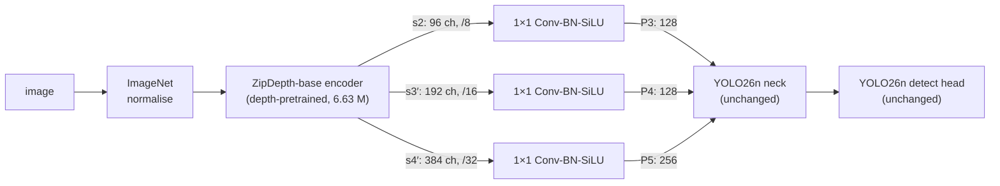

# ZipDepth as a Backbone for YOLO26n (KITTI)

Can features learned for **monocular depth estimation** be used for **object detection**?
This repository replaces the backbone of **YOLO26n** with the pretrained encoder of **ZipDepth**, keeps the YOLO26
neck and detection head unchanged, fine-tunes on **KITTI 2D detection** in Google Colab, and compares the result with
the original YOLO26n on mAP, parameter count, inference speed and GPU memory.

📄 **Full report:** [`report/zipdepth_yolo26n_report.pdf`](report/zipdepth_yolo26n_report.pdf)

---

## Approach

| Run | Backbone (YOLO26n layers 0–10) | Neck + head | Status |
|---|---|---|---|
| **A** | YOLO26n backbone, COCO-pretrained | YOLO26n, COCO-initialised | ✅ done |
| **B** | ZipDepth-base encoder, depth-pretrained + 1×1 adapters | YOLO26n, COCO-initialised | ✅ done |
| **C** *(optional)* | same as B, randomly initialised encoder | YOLO26n, COCO-initialised | ⏳ not run |

Only the backbone differs between runs: data, schedule, optimiser, seed, neck/head initialisation and evaluation code
are shared.



- The ZipDepth encoder produces a feature pyramid at the **same strides (8 / 16 / 32)** as the YOLO26n backbone, so its
  outputs `s2`, `s3′` and `s4′` feed the neck directly; 1×1 adapters match the channel counts (96/192/384 → 128/128/256).
- YOLO26n layer 0 becomes the ZipDepth module, layers 4 / 6 / 10 select P3 / P4 / P5, and the remaining backbone
  indices become pass-through placeholders, so every layer reference of the neck stays valid.
- Neck and head receive the **same COCO initialisation as Run A** (verified tensor by tensor).

## Results

Validation split (1,496 images, 8,128 objects), Tesla T4, both models measured back to back in one session.

| Metric | A: YOLO26n | B: ZipDepth backbone | B / A |
|---|---|---|---|
| **mAP50-95** | **0.588** | **0.472** | 0.80 |
| mAP50 | 0.849 | 0.731 | 0.86 |
| AP50-95 car / pedestrian / cyclist | 0.752 / 0.398 / 0.473 | 0.702 / 0.291 / 0.315 | — |
| AP50-95, small cars (< 25 px) | 0.550 | 0.470 | 0.85 |
| Parameters (fused) | 2.38 M | 7.14 M | 3.00× |
| GFLOPs @ 640 | 5.32 | 17.82 | 3.35× |
| Latency, batch 1, 640², FP16 | 12.3 ms | 11.8 ms | 0.96× |
| Throughput, batch 32, 640², FP16 | 513 img/s | 318 img/s | 0.62× |
| Peak GPU memory, training (batch 16) | 2,423 MiB | 2,829 MiB | 1.17× |
| Peak GPU memory, inference (batch 1 / 32, FP16) | 102 / 466 MiB | 131 / 786 MiB | 1.29× / 1.69× |

**Key findings**

- The ZipDepth backbone is **less accurate** (−0.116 mAP50-95) and lower on **every class and every object size**. Its
  errors are mostly **missed objects**, not class confusion (recall 0.762 → 0.679).
- It is **more expensive**: 3× parameters, 3.35× FLOPs and 0.62× throughput. Batch-1 latency on the T4 is unchanged
  only because it is dominated by kernel-launch overhead.
- **Depth hypothesis not supported:** the relative loss is largest for small (distant) objects, with small cars down
  15 % versus 5 % for large cars.
- Run B had **not converged** at 50 epochs (best epoch = last epoch), and Run C has not been run, so the effect of depth
  pretraining itself is still open.

See the [report](report/zipdepth_yolo26n_report.pdf) for training curves, per-class and per-size results, confusion
matrices, PCA feature-map visualisations and the discussion.

## Repository structure

```
├── README.md
├── report/
│   └── zipdepth_yolo26n_report.pdf       # full report
├── notebooks/
│   ├── baseline_yolo26n_kitti.ipynb      # Run A (executed, with outputs)
│   └── zipdepth_yolo26n_kitti.ipynb      # Run B + A-vs-B comparison (executed, with outputs)
├── src/
│   ├── zipdepth_yolo.py                  # ZipDepth backbone, model builder, trainer
│   └── lab_eval.py                       # shared evaluation: label table, size-bucket AP, PCA, latency, memory
├── configs/
│   └── exp_config.yaml                   # locked training configuration shared by all runs
└── results/
    ├── results_A.json, results_B.json    # all numbers of each run
    ├── comparison_AB.csv                 # final comparison table
    ├── qualitative_images.txt            # fixed image list for qualitative figures
    └── runs/{A_yolo26n,B_zipdepth}/      # results.csv, epoch_log.csv, args.yaml
```

The notebooks write their own copies of `src/*.py` with `%%writefile`, so they run without cloning this repository.
The files in `src/` are there for reading and reuse.

## How to run

The notebooks are designed for **Google Colab with a T4 GPU**. All outputs go to Google Drive (`MyDrive/lab/`), so an
interrupted session can be resumed.

1. **Run A:** open `notebooks/baseline_yolo26n_kitti.ipynb` in Colab and *Run all*. It downloads KITTI (YOLO format,
   ~390 MB), writes `exp_config.yaml` and `lab_eval.py` to Drive, trains YOLO26n (~1.5 h on a T4) and evaluates it.
2. **Run B:** open `notebooks/zipdepth_yolo26n_kitti.ipynb` and *Run all*. It clones ZipDepth, builds the modified
   model, runs 12 sanity checks (training starts only if all pass), trains (~1.5 h), and evaluates **both** models with
   identical code.

**Run A must be run first:** Run B reads the locked configuration and Run A's weights from Drive.

**Behaviour on re-runs:**

| Situation | What happens |
|---|---|
| Finished run on Drive | Training is skipped; everything is recomputed from `best.pt` |
| Interrupted run on Drive | Training resumes from `last.pt` |
| No GPU | The notebook switches to a small smoke-test mode (pipeline check only) |

**Run C (random encoder):** in the Run B notebook, set `ZipDepthTrainer.zipdepth_ckpt = None` (instead of the
checkpoint path) and use a new run name, e.g. `C_zipdepth_random`.

**Loading the trained Run B weights** requires `zipdepth_yolo.py` and the ZipDepth repository on `sys.path`, because
the checkpoint pickles the model classes:

```python
import sys
sys.path[:0] = ["ZipDepth", "src"]
from ultralytics import YOLO
model = YOLO("B_zipdepth/weights/best.pt")
```

## Verification

Before full training, the Run B notebook checks that:

1. P3/P4/P5 shapes match the YOLO26n backbone at 640×640 and 224×640.
2. All 232 encoder tensors equal `zipdepth_base.pth`.
3. The encoder inside the detector reproduces the original ZipDepth outputs exactly.
4. All 366 COCO-initialised neck/head tensors equal Run A's starting point.
5. Gradients reach the encoder, adapters and neck.
6. A one-image training step runs.
7. An interrupted run resumes correctly.
8. The model can overfit 32 training images.

The size-bucket AP in `lab_eval.py` reproduces Ultralytics' AP exactly when all sizes are included.

## Training configuration

| Setting | Value |
|---|---|
| Data | Ultralytics KITTI: 5,985 train / 1,496 val, 8 classes |
| Input | 640 (letterbox) |
| Schedule | 50 epochs, batch 16 (nbs 64), warm-up 3 epochs, mosaic off for the last 10 epochs |
| Optimiser | SGD, lr 0.01 → 1e-4 (linear), momentum 0.937, weight decay 5e-4 |
| Other | AMP, seed 0, deterministic, no early stopping, no layer freezing |

## Limitations

- Single seed per run.
- No held-out test set: KITTI test labels are not public, so the validation split is used both for checkpoint
  selection and for reporting. This applies equally to both runs.
- DontCare regions are removed from the labels, so detections of unlabelled distant objects count as false positives.
- Speed was measured on a Tesla T4 only.

## Environment

Python 3.13, PyTorch 2.11 (CUDA 12.8), Ultralytics 8.4.16x, Google Colab with a Tesla T4.

## Acknowledgements and licences

- **YOLO26n:** [Ultralytics](https://github.com/ultralytics/ultralytics) (AGPL-3.0). `yolo26n.pt` is downloaded automatically.
- **ZipDepth:** [fabiotosi92/ZipDepth](https://github.com/fabiotosi92/ZipDepth), checkpoint `zipdepth_base.pth`. The
  repository is cloned at runtime and is not included here; see its licence.
- **KITTI:** [KITTI Vision Benchmark](https://www.cvlibs.net/datasets/kitti/), in YOLO format from Ultralytics. The
  dataset is not redistributed here.
