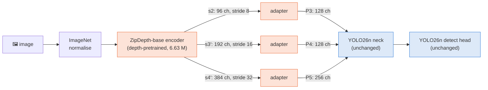
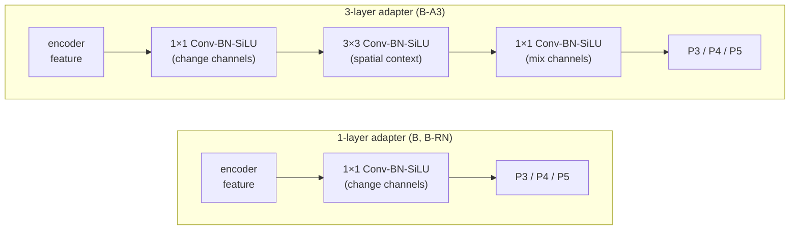
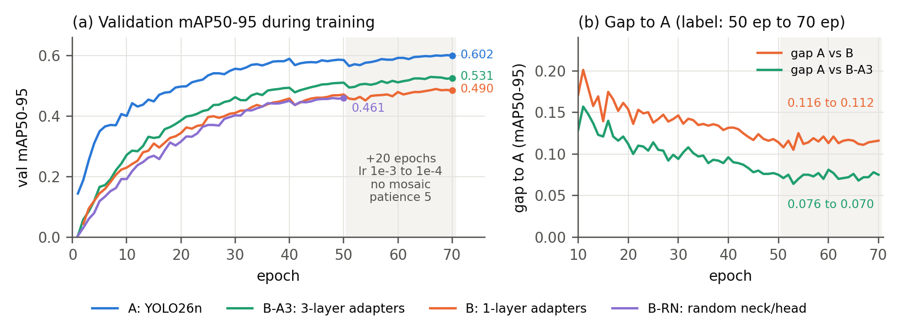
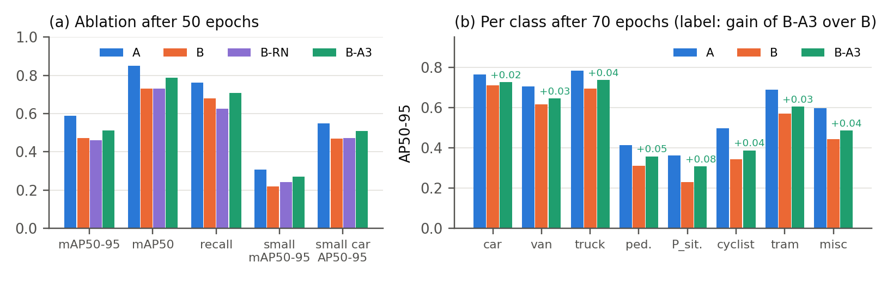
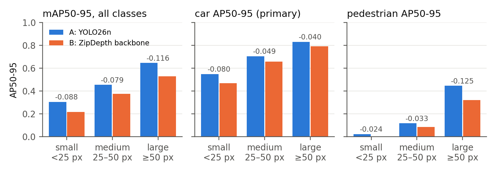
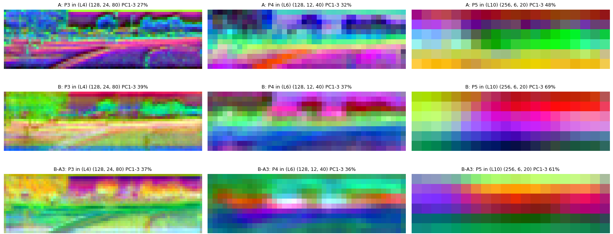
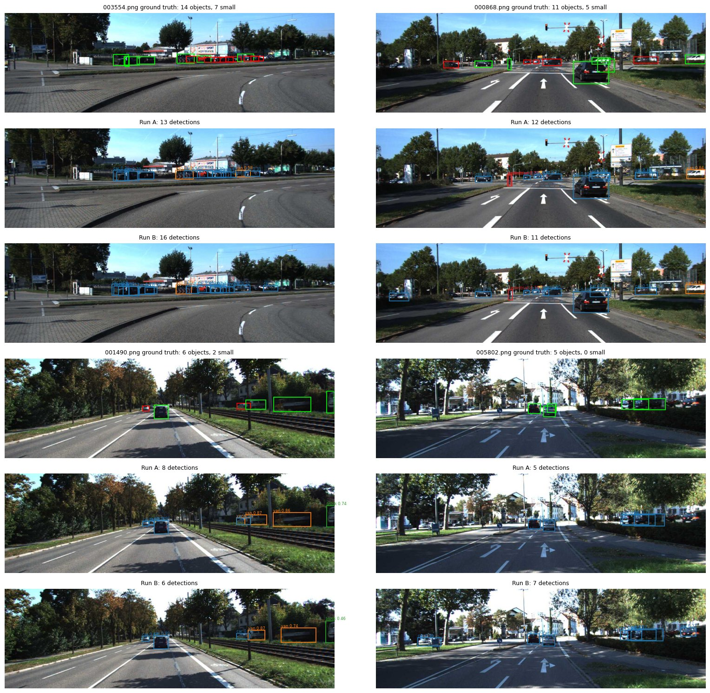

# 🚗 ZipDepth as a Backbone for YOLO26n (KITTI)


> **Can features learned for monocular depth estimation replace a detection backbone?**

This repository replaces the backbone of **YOLO26n** with the depth-pretrained encoder of **ZipDepth**, keeps the YOLO26
neck and detection head, fine-tunes on **KITTI 2D detection** in Google Colab, and compares the result with the original
YOLO26n on accuracy (mAP), parameter count, inference speed and GPU memory. Follow-up experiments test adapter depth,
neck/head initialisation and longer training with early stopping.

## 📄 Reports

| Report | Content |
|---|---|
| 📘 [Full report](report/zipdepth_yolo26n_report.pdf) (8 pages) | Method, A vs B results, per-class and per-size AP, confusion matrices, PCA feature maps, discussion |
| 📗 [Short report](report/zipdepth_yolo26n_report_short.pdf) (2 pages) | Summary of A vs B |
| 📙 [Follow-up report](report/zipdepth_yolo26n_followup_short.pdf) (2 pages) | 3-layer adapters, random neck/head, +20 epochs with early stopping |

## ⚡ TL;DR

- 🔻 The ZipDepth backbone is **less accurate** than YOLO26n's own backbone: best variant **0.531** vs **0.602** mAP50-95.
- 💸 It is **more expensive**: 3.4× parameters, 3.9× FLOPs, about 0.65× throughput.
- 🧩 **Deeper adapters help most** (+0.04 mAP50-95); a randomly initialised neck/head changes nothing.
- 📉 **Longer training does not close the gap**: all models gain about the same, and the ZipDepth models have plateaued.
- 🔭 **Depth hypothesis not supported**: depth pretraining gives no advantage on small, distant objects.

---

## 🧪 Experiments

| Run | Backbone (YOLO26n layers 0 to 10) | Adapters | Neck + head init | Status |
|---|---|---|---|---|
| **A** | YOLO26n backbone, COCO-pretrained | none | COCO | ✅ done |
| **B** | ZipDepth-base encoder, depth-pretrained | 1 layer (1×1) | COCO | ✅ done |
| **B-A3** | ZipDepth-base encoder, depth-pretrained | 3 layers (1×1, 3×3, 1×1) | COCO | ✅ done |
| **B-RN** | ZipDepth-base encoder, depth-pretrained | 1 layer (1×1) | random | ✅ done |
| **A / B / B-A3 + ft** | same models, continued for up to 20 epochs | | | ✅ done |
| **C** *(optional)* | ZipDepth-base encoder, random init | 3 layers | COCO | ⏳ not run |

Each variant changes exactly one thing compared with Run B. Data, schedule, optimiser, seed and evaluation code are shared.

### 🏗️ Architecture



- The ZipDepth encoder produces a feature pyramid at the **same strides (8 / 16 / 32)** as the YOLO26n backbone, so its
  outputs `s2`, `s3′` and `s4′` can feed the neck directly. Adapters match the channel counts (96 / 192 / 384 to
  128 / 128 / 256).
- YOLO26n layer 0 becomes the ZipDepth module, layers 4 / 6 / 10 select P3 / P4 / P5, and the remaining backbone indices
  become pass-through placeholders, so every layer reference in the neck stays valid.
- Neck and head start from the **same COCO weights as Run A** (verified tensor by tensor), except in B-RN.

### 🧩 Adapter variants



| Adapters | Adapter parameters | Total params (fused) | GFLOPs @ 640 |
|---|---|---|---|
| 1 layer | 0.136 M | 7.14 M | 17.8 |
| 3 layers | 1.121 M | 8.13 M | 21.0 |

---

## 📊 Results

Validation split: 1,496 images, 8,128 objects. Throughput measured back to back on a Tesla T4 in one Colab session.

| Run | mAP50-95 (50 ep) | mAP50-95 (70 ep) | mAP50 (70 ep) | Small cars AP50-95 (70 ep) | Params (fused) | GFLOPs | Throughput (b32, FP16) |
|---|---|---|---|---|---|---|---|
| 🔵 **A: YOLO26n** | 0.588 | **0.602** | 0.863 | 0.563 | 2.38 M | 5.3 | 419 img/s |
| 🟠 **B** | 0.472 | 0.490 | 0.748 | 0.479 | 7.14 M | 17.8 | 288 img/s |
| 🟣 **B-RN** | 0.461 | not run | not run | not run | 7.14 M | 17.8 | ≈ B |
| 🟢 **B-A3** | 0.512 | **0.531** | 0.802 | 0.530 | 8.13 M | 21.0 | 270 img/s |

"70 ep" is the best checkpoint after the 20-epoch continuation. Peak training memory (batch 16): A 2,423 MiB,
B 2,829 MiB, B-A3 3,081 MiB. Batch-1 latency is about 11 ms for all models, because on the T4 it is dominated by
kernel-launch overhead.

### 📈 Training curves and gap to YOLO26n



*(a) Validation mAP50-95 per epoch; the shaded area is the continuation (lr 1e-3 to 1e-4, no mosaic, patience 5).
(b) Gap between A and each ZipDepth model.*

**Can longer training close the gap? No.**

- In the 20 continuation epochs A improved by 0.012, B by 0.018 and B-A3 by 0.020, so the gap to A shrank by only
  **0.006** for B-A3 (from 0.076 to 0.070) and 0.004 for B (from 0.116 to 0.112).
- B-A3 gained 0.0017 mAP per epoch at the end of the first 50 epochs, but lost 0.0012 per epoch over the last 5
  continuation epochs, so it has plateaued. A is still rising slowly (0.0007 per epoch).
- At the narrowing rate actually measured (about 0.0003 per epoch), closing the remaining 0.070 would take more than
  200 further epochs.

### 🧩 Adapter depth and neck/head initialisation



*(a) All variants after the common 50-epoch schedule. (b) AP50-95 per class after 70 epochs; labels give the gain of the
3-layer adapters over B.*

- **3-layer adapters** add 0.040 mAP50-95 after 50 epochs and 0.041 after 70, on all 8 classes and especially on small
  objects (small mAP50-95 0.067 higher). A single 1×1 layer is only a linear projection; the 3×3 layer adds spatial
  context and non-linearity.
- **A random neck/head (B-RN)** is 0.011 below B, within single-seed noise. COCO initialisation of the neck/head is worth
  only about 0.01, so the gap to A comes from the backbone features, not from the decoder.

### 🔭 Object size (A vs B)



*AP50-95 by ground-truth box height (small under 25 px, medium 25 to 50 px, large 50 px and above).*

Depth pretraining was expected to help small, distant objects, but the opposite happens: for B, small cars lose 15 %
compared with 5 % for large cars. Even with 3-layer adapters (B-A3, 70 epochs), small cars are 6 % below A and large cars
5 % below A, so there is no advantage for distant objects.

### 🎨 Feature maps (PCA)



*PCA-RGB of the backbone outputs handed to the neck (P3 / P4 / P5) on the same validation image; rows A, B, B-A3. Titles
give the variance explained by three components.*

ZipDepth's P5 is a smooth, depth-like layout gradient (69 % of variance in three components for B, compared with 48 % for
A) with less local detail in P3. The 3-layer adapters reduce this a little (61 %).

### 🖼️ Qualitative examples

<details>
<summary>Show detections of A and B on four validation images</summary>



*Ground truth (green: normal, red: small), then Run A and Run B detections for the same image.*

</details>

---

## 📁 Repository structure

```
├── README.md
├── report/
│   ├── zipdepth_yolo26n_report.pdf             # full report (A vs B)
│   ├── zipdepth_yolo26n_report_short.pdf       # 2-page summary (A vs B)
│   └── zipdepth_yolo26n_followup_short.pdf     # 2-page follow-up (B-A3, B-RN, +20 epochs)
├── notebooks/
│   ├── baseline_yolo26n_kitti.ipynb            # Run A
│   ├── zipdepth_yolo26n_kitti.ipynb            # Run B + A vs B comparison
│   ├── zipdepth_yolo26n_adapter3_kitti.ipynb   # Run B-A3 + comparison with A and B
│   ├── zipdepth_yolo26n_randneck_kitti.ipynb   # Run B-RN + comparison with A and B
│   └── zipdepth_yolo26n_adapter3_ft_kitti.ipynb  # +20 epochs with early stopping for A, B, B-A3
├── src/
│   ├── zipdepth_yolo.py                        # ZipDepth backbone, adapters, model builder, trainer
│   ├── lab_eval.py                             # shared evaluation: size-bucket AP, PCA, latency, memory
│   └── fig_curves_gap.py                       # training-curve and gap figure
├── configs/
│   └── exp_config.yaml                         # locked training configuration shared by all runs
├── docs/figures/                               # figures used in this README
└── results/
    ├── results_*.json                          # all numbers of each run
    ├── comparison_*.csv                        # final comparison tables
    ├── qualitative_images.txt                  # fixed image list for qualitative figures
    └── runs/<run>/                             # results.csv, epoch_log.csv, args.yaml
```

The notebooks write their own copies of `src/*.py` with `%%writefile`, so they run without cloning this repository. The
files in `src/` are there for reading and reuse.

## 💾 Trained weights

Weights are attached to the [**v1.0 release**](../../releases/tag/v1.0), not stored in the repository.

| File | Run | Epochs | mAP50-95 |
|---|---|---|---|
| `best_A_yolo26n.pt` | A | 50 | 0.588 |
| `best_B_zipdepth.pt` | B | 50 | 0.472 |
| `best_B_zipdepth_a3.pt` | B-A3 | 50 | 0.512 |
| `best_B_zipdepth_rn.pt` | B-RN | 50 | 0.461 |
| `best_A_yolo26n_70ep.pt` | A | 70 | 0.602 |
| `best_B_zipdepth_70ep.pt` | B | 70 | 0.490 |
| `best_B_zipdepth_a3_70ep.pt` | B-A3 | 70 | 0.531 |

The ZipDepth checkpoints pickle the model classes, so `zipdepth_yolo.py` and the ZipDepth repository must be on
`sys.path` when loading them:

```python
import sys
sys.path[:0] = ["ZipDepth", "src"]            # git clone https://github.com/fabiotosi92/ZipDepth
from ultralytics import YOLO
model = YOLO("best_B_zipdepth_a3_70ep.pt")
results = model.predict("image.png")
```

## 🚀 How to run

The notebooks are designed for **Google Colab with a T4 GPU**. All outputs go to Google Drive (`MyDrive/lab/`), so an
interrupted session can be resumed.

1. **Run A:** open `notebooks/baseline_yolo26n_kitti.ipynb` and *Run all*. It downloads KITTI (YOLO format, about
   390 MB), writes `exp_config.yaml` and `lab_eval.py` to Drive, trains YOLO26n (about 1.5 h) and evaluates it.
2. **Run B:** open `notebooks/zipdepth_yolo26n_kitti.ipynb` and *Run all*. It clones ZipDepth, builds the modified model,
   runs the sanity checks (training starts only if all pass), trains (about 1.5 h), and evaluates A and B with identical
   code.
3. **B-A3 / B-RN:** open `zipdepth_yolo26n_adapter3_kitti.ipynb` or `zipdepth_yolo26n_randneck_kitti.ipynb` and
   *Run all*. Both need the finished Runs A and B on Drive and compare all three models.
4. **Continuation (+20 epochs):** `zipdepth_yolo26n_adapter3_ft_kitti.ipynb` continues A, B and B-A3 from their best
   weights (`epochs=20, patience=5, lr0=0.001, lrf=0.1, warmup_epochs=0, close_mosaic=20`) as new runs with the `_ft`
   suffix, then re-runs the evaluation on them.

⚠️ **Order matters:** Run A first, then Run B, then the variants. They read the locked configuration and earlier
weights from Drive.

**Behaviour on re-runs:**

| Situation | What happens |
|---|---|
| ✅ Finished run on Drive | Training is skipped; everything is recomputed from `best.pt` |
| 🔁 Interrupted run on Drive | Training resumes from `last.pt` |
| 💻 No GPU | The notebook switches to a small smoke-test mode (pipeline check only) |

**Model options** (setup cell of the variant notebooks):

| Setting | Meaning |
|---|---|
| `ADAPTER_LAYERS = 1 / 2 / 3` | adapter depth (1×1; 1×1 + 3×3; 1×1 + 3×3 + 1×1) |
| `COCO_NECK_HEAD = True / False` | neck and head from COCO or random |
| `ZipDepthTrainer.zipdepth_ckpt = None` | random encoder (Run C) |
| `SCHEDULE = {"epochs": 70, "patience": 10}` | fresh longer run (gets the `_long` suffix) |

## ✔️ Verification

Before full training, every ZipDepth notebook checks that:

1. P3 / P4 / P5 shapes match the YOLO26n backbone at 640×640 and 224×640.
2. All 232 encoder tensors equal `zipdepth_base.pth`.
3. The encoder inside the detector reproduces the original ZipDepth outputs exactly.
4. The neck/head is initialised as intended: all 366 tensors equal Run A's COCO start (B, B-A3), or none of them (B-RN).
5. The adapters have the requested depth and parameter count.
6. Gradients reach the encoder, adapters and neck, and a one-image training step runs.
7. An interrupted run resumes correctly and the saved model reloads and predicts.
8. The model can overfit 32 training images.

The size-bucket AP in `lab_eval.py` reproduces Ultralytics' AP exactly when all sizes are included.

## ⚙️ Training configuration

| Setting | First 50 epochs | Continuation (up to 20 epochs) |
|---|---|---|
| Data | Ultralytics KITTI: 5,985 train / 1,496 val, 8 classes | same |
| Input | 640 (letterbox) | same |
| Batch | 16 (nbs 64) | same |
| Optimiser | SGD, momentum 0.937, weight decay 5e-4 | same |
| Learning rate | 0.01 to 1e-4 (linear), 3 warm-up epochs | 1e-3 to 1e-4 (linear), no warm-up |
| Mosaic | off for the last 10 epochs | off |
| Early stopping | none (patience 100) | patience 5 (not triggered) |
| Other | AMP, seed 0, deterministic, no layer freezing | same |

## ⚠️ Limitations

- Single seed per run, so differences of about 0.01 (B vs B-RN) are within noise.
- No held-out test set: KITTI test labels are not public, so the validation split is used both for checkpoint selection
  and for reporting. This applies equally to all runs.
- The continuation is not identical to a fresh 70-epoch schedule, but it was applied to A, B and B-A3 alike.
- DontCare regions are removed from the labels, so detections of unlabelled distant objects count as false positives.
- Speed was measured on a Tesla T4 only; absolute throughput varies between Colab sessions, so only numbers from the same
  session are compared.
- Run C (random encoder) has not been run, so the value of depth pretraining itself is not isolated.

## 🛠️ Environment

Python 3.13, PyTorch 2.11, Ultralytics 8.4.16x / 8.4.171, Google Colab with a Tesla T4.

## 🙏 Acknowledgements and licences

- **YOLO26n:** [Ultralytics](https://github.com/ultralytics/ultralytics) (AGPL-3.0). `yolo26n.pt` is downloaded automatically.
- **ZipDepth:** [fabiotosi92/ZipDepth](https://github.com/fabiotosi92/ZipDepth), checkpoint `zipdepth_base.pth`. The
  repository is cloned at runtime and is not included here; see its licence.
- **KITTI:** [KITTI Vision Benchmark](https://www.cvlibs.net/datasets/kitti/), in YOLO format from Ultralytics. The
  dataset is not redistributed here.
